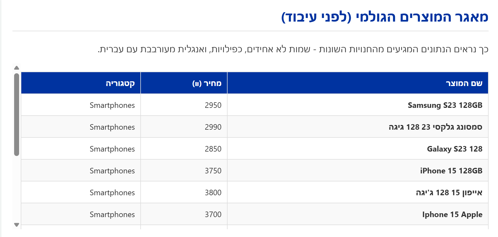
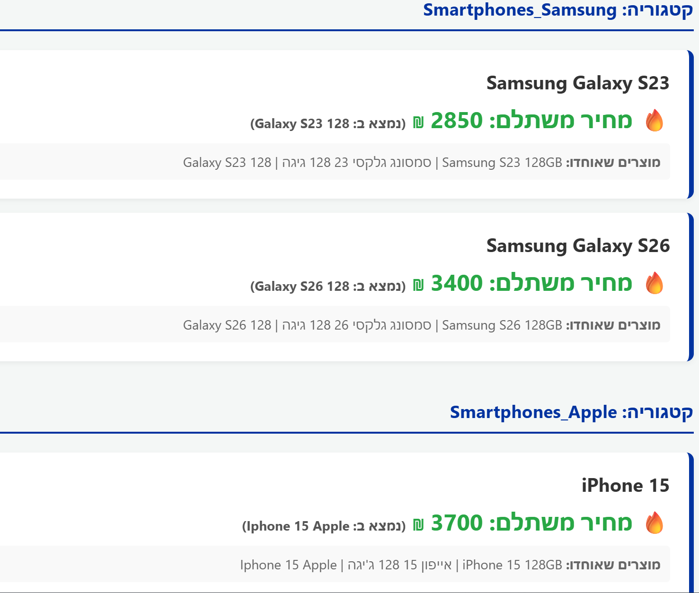
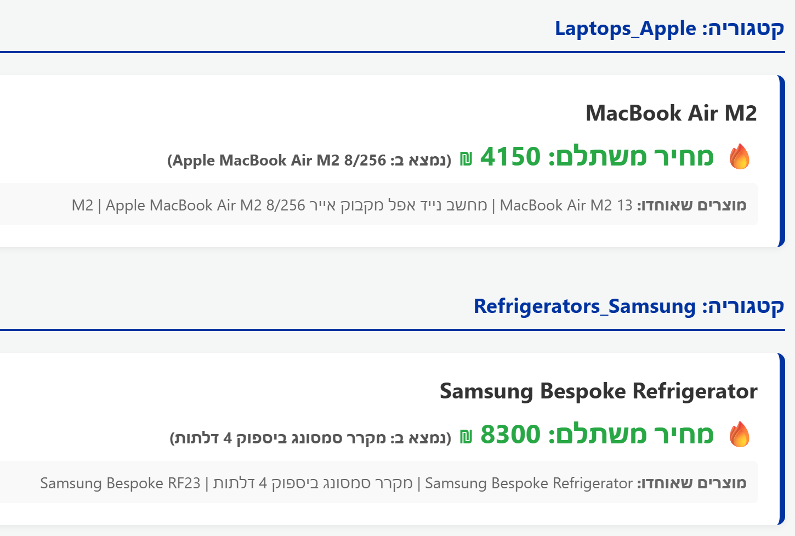

## Project Overview
This project demonstrates an AI-driven, highly scalable approach to **Entity Resolution** (resolving unstructured and inconsistent e-commerce product names). The goal is to group identical products despite variations in naming, typos, or cross-language inputs, and display the lowest price for each unified product.

## Input Data Preview
The pipeline starts from a mixed product table with different languages, spellings, and duplicate listings.



## Engineering Architecture & The "LLM as a Judge" Approach
Relying solely on complex Regex patterns scales poorly in an e-commerce environment with millions of diverse products. They require endless maintenance and fail on edge cases. Conversely, sending a massive unstructured database directly to an LLM context window is neither technically feasible nor cost-effective.

**This solution implements a robust Data Pipeline:**

1. **Pre-Filtering & Blocking (Code Logic):**
   Before contacting the LLM, the Python code utilizes structured data (`category`) and dynamic text extraction (`brand` keyword matching via an externalized dictionary) to partition the data into highly specific micro-buckets (e.g., `Smartphones_Apple`, `Refrigerators_Samsung`).
2. **LLM as a Judge (Semantic Resolution):**
   The **Gemini API** receives only these isolated micro-buckets. It effortlessly bridges semantic gaps (e.g., "אייפון 15" vs "Iphone 15"). The LLM is strictly constrained to output a valid JSON mapping.
3. **Deterministic Business Logic & Data Integrity:**
   Calculating the minimum price is done entirely in Python using a hash map for $O(1)$ lookup time, avoiding mathematical hallucinations by the LLM. Finally, a strict **Data Validation** step ensures that `Input IDs == Output IDs`, guaranteeing no data was lost during the LLM transaction.

## Resolution Examples
These screenshots show the grouped output and the final canonical product cards produced by the pipeline.

### Smartphones


### Other Categories


## Code Structure (SOLID Principles)
* **Separation of Concerns:** Business logic (Python), Configuration/Data (config.py), and AI semantics (LLM Prompt) are strictly decoupled.
* **Open/Closed Principle:** The keyword dictionary is externalized in `config.py`, allowing product managers to add new brands without modifying the core pipeline logic.

## How to Run
1. Open the project folder in PowerShell.
2. Install the dependencies:
   ```powershell
   pip install -r requirements.txt
   ```
3. Make sure the Gemini key is set in [config.py](config.py) under `LOCAL_API_KEY`.
https://aistudio.google.com/u/2/api-keys
4. Start the app:
   ```powershell
   python main.py
   ```
5. Open the app in your browser:
   ```text
   http://127.0.0.1:8000
   ```
6. Click the main button to run the entity-resolution pipeline.

### Terminal Debug Mode (No Browser)
You can run the full pipeline directly in terminal and print the final JSON result:

```powershell
python main.py --cli
```

Expected result:
* The page loads with the project header and run button.
* The pipeline groups similar products into canonical results.
* Each card shows the final product name, the lowest price, and the merged source listings.